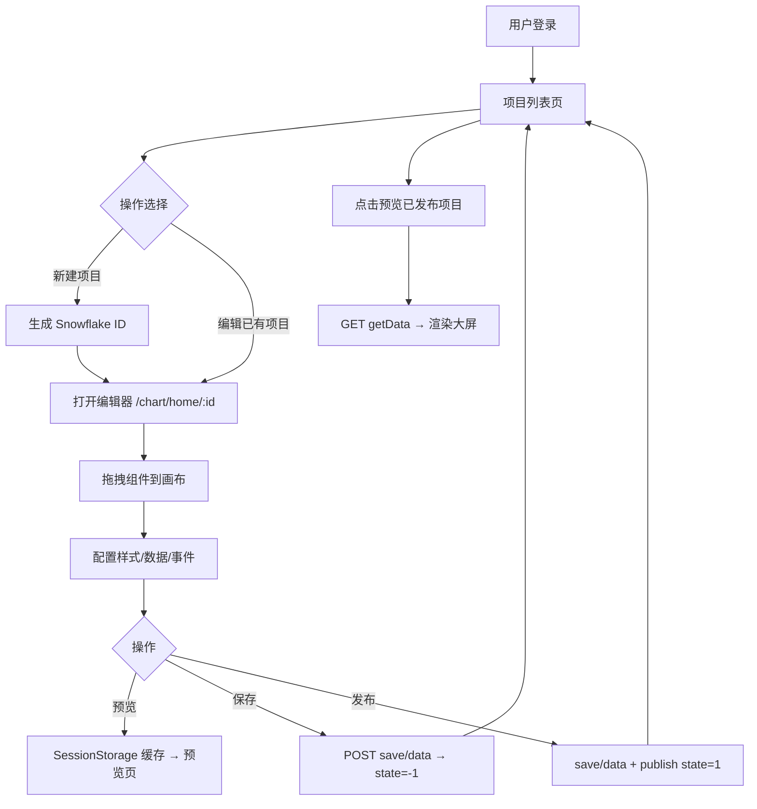

# GoView 大屏项目分析文档

> 文档生成时间：2026-05-20  
> 项目根目录：`goview/`（包含前端 `go-view`、后端 `go-view-serve`、部署 `deploy`）

---

## 1. 项目概述

本项目是基于开源 **[GoView](https://gitee.com/dromara/go-view)** 二次开发的数据可视化低代码大屏平台，采用 **前后端分离** 架构：

| 模块 | 目录 | 说明 |
|------|------|------|
| 前端 | `go-view/` | Vue3 低代码大屏编辑器 + 预览展示 |
| 后端 | `go-view-serve/` | Spring Boot 项目/用户/文件管理 API |
| 部署 | `deploy/` | Nginx、MySQL 初始化、一键部署脚本 |

**线上环境（当前配置）：**

- 前端访问：`https://screen.liulaoban.online`（Nginx 8090 端口）
- 后端 API：`8083`（Nginx 反代 `/api`）
- 默认账号：`admin` / `123456`

---

## 2. 技术栈

### 2.1 前端（go-view）

| 分类 | 技术 | 版本/说明 |
|------|------|-----------|
| 核心框架 | Vue 3 + TypeScript | Vue 3.5.x，TS 4.6.x |
| 构建工具 | Vite | 4.3.x |
| UI 组件库 | Naive UI | 2.40.x |
| 状态管理 | Pinia | 2.0.x |
| 路由 | Vue Router | 4.0.x（Hash 模式） |
| 图表 | ECharts + VChart | 柱状/折线/地图/水球等 |
| HTTP | Axios | Token 鉴权（satoken 请求头） |
| 样式 | Sass + animate.css | 全局 SCSS 变量注入 |
| 编辑器 | Monaco Editor | 代码/JSON/事件编辑 |
| 拖拽 | vue3-sketch-ruler + vuedraggable | 画布标尺与组件拖拽 |
| 地图 | 高德地图 JS API | @amap/amap-jsapi-loader |
| 3D | Three.js | 装饰类 3D 组件 |
| 国际化 | vue-i18n | 中/英 |
| 工具 | dayjs、crypto-js、lodash、gsap、html2canvas | 时间/加密/动画/截图 |

**开发环境要求：**

- Node.js >= 16.14（推荐 18.20.x）
- pnpm 8.x 或 npm 10.x

### 2.2 后端（go-view-serve）

| 分类 | 技术 | 版本/说明 |
|------|------|-----------|
| 核心框架 | Spring Boot | 2.7.6 |
| JDK | Java 8+ | 生产环境 JDK 17+ 需加 `--add-opens` 参数 |
| ORM | MyBatis-Plus | 3.4.3 |
| 数据库 | MySQL 8.0 | 库名 `goview` |
| 连接池 | Druid | 1.2.x |
| 鉴权 | Sa-Token | 1.34.x，Token 名 `satoken` |
| API 文档 | Knife4j (Swagger) | 2.0.7 |
| 工具库 | Hutool | 5.3.x |
| 打包 | Maven WAR | 产物 `goview_admin-0.0.1-SNAPSHOT.war` |

### 2.3 部署与基础设施

| 组件 | 说明 |
|------|------|
| Nginx | 静态资源 + `/api`、`/oss` 反向代理 |
| MySQL | Docker 容器，3306 端口 |
| 文件存储 | 本地磁盘（`/opt/big-screen-service/upload`） |
| HTTPS | Certbot + Let's Encrypt |

---

## 3. 业务功能

### 3.1 用户与权限

- 用户登录 / 登出（MD5 密码校验 + Sa-Token）
- 路由守卫：未登录跳转登录页
- Token 持久化：`localStorage` 存储，Axios 自动携带 `satoken` 请求头

### 3.2 项目管理

- **我的项目**：项目列表（分页）、创建、重命名、删除
- **项目状态**：`-1` 未发布 / `1` 已发布
- **保存**：将画布 JSON 存入 `t_goview_project_data.content`
- **发布**：保存数据并将 `state` 设为 `1`
- **预览**：SessionStorage 临时缓存，新窗口打开预览页

### 3.3 低代码编辑器（核心）

- **画布编辑**：拖拽、缩放、对齐、图层管理、撤销/重做
- **组件库**（7 大类）：
  - Charts（ECharts 图表）
  - VChart（字节 VChart 图表）
  - Informations（文字、图片、视频、iframe、输入控件等）
  - Tables（表格、滚动排名）
  - Decorates（边框、装饰、数字翻牌、时钟、3D 地球等）
  - Photos（图片素材库）
  - Icons（图标库）
- **数据配置**：静态数据 / HTTP 动态请求 / SQL 请求
- **数据过滤**：JavaScript 过滤器处理接口返回
- **事件系统**：组件交互、高级事件（Monaco 编辑 JS）
- **主题**：多套图表主题、亮/暗色、自定义颜色
- **JSON 编辑模式**：直接编辑大屏 JSON 配置

### 3.4 模板（前端页面）

- 我的模板
- 模板市场（UI 入口，可扩展对接后端）

### 3.5 文件管理

- 项目内图片/素材上传（`/api/goview/project/upload`）
- 通用文件 API（`/api/file/*`）
- 静态资源访问（`/oss/{virtualKey}/{date}/{filename}`）

### 3.6 大屏预览

- 独立预览路由 `#/chart/preview/:id`
- 自适应缩放、全屏展示
- 组件动态注册与数据轮询刷新

---

## 4. 项目目录结构

```
goview/
├── go-view/                          # 前端项目
│   ├── src/
│   │   ├── api/                      # API 层
│   │   │   ├── axios.ts              # Axios 实例 + 拦截器
│   │   │   ├── http.ts               # get/post/put/del + 动态请求
│   │   │   └── modules/              # 业务 API（project.ts, sys.ts）
│   │   ├── assets/                   # 静态资源（图片、视频）
│   │   ├── components/               # 全局通用组件（GoLoading、GoVChart 等）
│   │   ├── enums/                    # 枚举（路由、HTTP、Storage）
│   │   ├── hooks/                    # 全局 Hooks
│   │   ├── i18n/                     # 国际化
│   │   ├── layout/                   # 布局组件
│   │   ├── packages/                 # ★ 大屏组件库（核心）
│   │   │   ├── components/           # 各类图表/装饰/信息组件
│   │   │   │   ├── Charts/           # ECharts 图表
│   │   │   │   ├── VChart/           # VChart 图表
│   │   │   │   ├── Informations/     # 信息类组件
│   │   │   │   ├── Tables/           # 表格类
│   │   │   │   ├── Decorates/        # 装饰类
│   │   │   │   ├── Photos/           # 图片库
│   │   │   │   └── Icons/            # 图标库
│   │   │   ├── public/               # 组件公共基类
│   │   │   └── index.ts              # 组件注册与动态加载
│   │   ├── plugins/                  # NaiveUI、图标、指令注册
│   │   ├── router/                   # 路由 + 守卫
│   │   │   └── modules/              # 分模块路由
│   │   ├── settings/                 # 主题、动画、图表主题配置
│   │   ├── store/                    # Pinia 状态
│   │   │   └── modules/
│   │   │       ├── chartEditStore/   # ★ 编辑器核心状态
│   │   │       ├── chartLayoutStore/ # 布局面板状态
│   │   │       ├── chartHistoryStore/# 撤销/重做
│   │   │       ├── packagesStore/    # 组件库状态
│   │   │       └── settingStore/     # 系统设置
│   │   ├── styles/                   # 全局样式
│   │   ├── utils/                    # 工具函数
│   │   └── views/                    # 页面视图
│   │       ├── login/                # 登录
│   │       ├── project/              # 项目列表/模板
│   │       ├── chart/                # ★ 编辑器工作台
│   │       ├── preview/              # 预览页
│   │       └── edit/                 # JSON 编辑
│   ├── .env                          # 开发环境变量
│   ├── .env.production               # 生产环境变量
│   ├── vite.config.ts                # Vite 配置
│   └── package.json
│
├── go-view-serve/                      # 后端项目
│   └── src/main/
│       ├── java/cn/com/
│       │   ├── GogoApplication.java  # 启动类
│       │   └── v2/
│       │       ├── controller/       # ★ 控制器层
│       │       │   ├── ApiController.java          # 登录/登出
│       │       │   ├── GoviewProjectController.java# 项目 CRUD + 数据存取
│       │       │   └── FileController.java         # 文件上传/下载
│       │       ├── service/          # 业务逻辑
│       │       │   └── impl/
│       │       ├── mapper/           # MyBatis Mapper 接口
│       │       ├── model/            # 实体类 + VO
│       │       ├── common/           # 公共配置/拦截器/响应封装
│       │       └── util/             # 工具类
│       └── resources/
│           ├── application.yml       # 主配置
│           ├── application-dev.yml   # 开发数据库
│           ├── application-prod.yml  # 生产数据库
│           └── mapper/               # MyBatis XML
│
└── deploy/                           # 部署相关
    ├── DEPLOY.md                     # 详细部署文档
    ├── nginx-big-screen.conf         # Nginx 配置
    ├── application-prod.yml          # 生产配置模板
    ├── init-mysql.sql                # 数据库初始化
    ├── server-setup.sh               # 服务器一键部署
    └── big-screen-deploy.tar.gz      # 打包好的发布包
```

---

## 5. 数据库设计

| 表名 | 说明 | 关键字段 |
|------|------|----------|
| `t_sys_user` | 系统用户 | username, password(MD5) |
| `t_goview_project` | 大屏项目 | project_name, state(-1/1), index_image |
| `t_goview_project_data` | 项目画布数据 | project_id, content(LONGTEXT JSON) |
| `t_sys_file` | 上传文件记录 | file_name, virtual_key, relative_path |

**项目状态说明：**

- `state = -1`：未发布（编辑中或已保存未发布）
- `state = 1`：已发布（可在项目列表展示为已发布状态）

---

## 6. API 接口一览

### 6.1 系统接口

| 方法 | 路径 | 说明 |
|------|------|------|
| POST | `/api/goview/sys/login` | 登录 |
| GET | `/api/goview/sys/logout` | 登出 |

### 6.2 项目接口

| 方法 | 路径 | 说明 |
|------|------|------|
| GET | `/api/goview/project/list` | 项目列表（分页） |
| POST | `/api/goview/project/create` | 创建项目 |
| POST | `/api/goview/project/edit` | 编辑项目信息 |
| POST | `/api/goview/project/rename` | 重命名 |
| DELETE | `/api/goview/project/delete` | 删除（ids 参数） |
| PUT | `/api/goview/project/publish` | 发布/取消发布 |
| GET | `/api/goview/project/getData` | 获取画布 JSON |
| POST | `/api/goview/project/save/data` | 保存画布 JSON |
| POST | `/api/goview/project/upload` | 上传素材 |

### 6.3 文件接口

| 方法 | 路径 | 说明 |
|------|------|------|
| POST | `/api/file/upload` | 通用文件上传 |
| DELETE | `/api/file/remove` | 删除文件 |

---

## 7. 业务流程

### 7.1 整体业务流



### 7.2 编辑器数据流

1. **初始化**：路由参数 `:id` → `getProjectData(projectId)` → 解析 `content` JSON → 写入 `chartEditStore`
2. **编辑过程**：所有组件/画布变更实时保存在 Pinia `chartEditStore`
3. **保存/发布**：`chartEditStore.getStorageInfo()` 序列化为 JSON → `saveProjectData({ projectId, content })`
4. **预览**：当前 store 快照写入 SessionStorage → 跳转 `#/chart/preview/:id`

### 7.3 前端路由结构

| 路由 | 页面 | 说明 |
|------|------|------|
| `#/login` | 登录 | 无需 Token |
| `#/project/items` | 我的项目 | 默认首页 |
| `#/project/my-template` | 我的模板 | |
| `#/project/template-market` | 模板市场 | |
| `#/chart/home/:id` | 编辑器 | 核心工作台 |
| `#/chart/preview/:id` | 预览 | 大屏展示 |
| `#/chart/edit/:id` | JSON 编辑 | 代码模式 |

---

## 8. 启动方式

### 8.1 环境准备

**公共：**

```bash
# MySQL 8.0 本地运行，导入初始化脚本
mysql -uroot -p < deploy/release/init-mysql.sql
# 或
mysql -uroot -p < deploy/init-mysql.sql
```

### 8.2 后端启动

```bash
cd go-view-serve

# 1. 确认 application.yml 中 spring.profiles.active=dev
# 2. 确认 application-dev.yml 中数据库账号密码

# 方式一：IDE 运行 GogoApplication.java

# 方式二：Maven 打包后运行
mvn clean package -DskipTests
java -jar target/goview_admin-0.0.1-SNAPSHOT.war

# JDK 17+ 需加参数
java --add-opens java.base/java.lang.invoke=ALL-UNNAMED \
  -jar target/goview_admin-0.0.1-SNAPSHOT.war
```

- 默认端口：**8083**
- 文件上传目录：`go-view-serve/upload/`（可在 `application.yml` 的 `v2.fileurl` 修改）
- API 文档：`http://localhost:8083/doc.html`（Knife4j）

### 8.3 前端启动

```bash
cd go-view

# 安装依赖
pnpm install
# 或 npm install

# 开发模式（默认 http://localhost:3020，.env 中 VITE_DEV_PORT=8001 为备用说明）
pnpm dev

# 生产构建
pnpm build
# 产物在 dist/ 目录
```

**环境变量（`.env`）：**

```env
VITE_API_BASE_URL = 'http://localhost:8083'   # 后端地址
VITE_DEV_PORT = '8001'
VITE_GLOB_APP_TITLE = GoView
```

### 8.4 本地联调访问

1. 启动 MySQL → 导入 SQL
2. 启动后端 `8083`
3. 启动前端 `pnpm dev`（端口以 vite.config.ts 为准，当前为 **3020**）
4. 浏览器打开 `http://localhost:3020`
5. 登录：`admin` / `123456`

---

## 9. 开发与发布流程

### 9.1 日常开发流程

```
1. 从 master 拉取最新代码
2. 配置本地 MySQL + application-dev.yml
3. 分别启动后端 (8083) 和前端 (pnpm dev)
4. 开发功能 → 本地验证
5. 前端 lint: pnpm lint / pnpm lint:fix
6. 提交代码（commit 规范见下方）
```

**Commit 规范：**

- `feat:` 新功能
- `fix:` 修复 Bug
- `docs:` 文档
- `refactor:` 重构
- `style:` 样式
- `chore:` 杂项

### 9.2 生产发布流程

#### 方式 A：分步部署（开发机打包上传）

**后端：**

```bash
cd go-view-serve
# 复制 deploy/application-prod.yml → src/main/resources/application-prod.yml
# 修改 MySQL 密码、文件路径
# application.yml 设置 spring.profiles.active: prod

mvn clean package -DskipTests
scp target/goview_admin-0.0.1-SNAPSHOT.war ubuntu@服务器IP:/opt/big-screen-service/
```

**前端：**

```bash
cd go-view
# 确认 .env.production 中 VITE_API_BASE_URL 为生产域名
pnpm build
scp -r dist/* ubuntu@服务器IP:/var/www/big-screen/dist/
```

**服务器：**

```bash
# 启动后端
cd /opt/big-screen-service
nohup java --add-opens java.base/java.lang.invoke=ALL-UNNAMED \
  -jar goview_admin-0.0.1-SNAPSHOT.war --spring.profiles.active=prod > app.log 2>&1 &

# 重载 Nginx
sudo nginx -t && sudo systemctl reload nginx
```

#### 方式 B：一键部署包

```bash
# 本地已打好包：deploy/big-screen-deploy.tar.gz
# 上传到服务器 /home/ubuntu 后：
tar -xzf big-screen-deploy.tar.gz -C big-screen-deploy
cd big-screen-deploy && bash server-setup.sh
```

详细步骤见：`deploy/DEPLOY.md`、`deploy/一键上传说明.md`

### 9.3 生产环境架构

```
用户浏览器
    ↓ HTTPS/HTTP :8090
Nginx (/var/www/big-screen/dist)
    ├── /          → 前端 SPA (try_files → index.html)
    ├── /api/      → 反代 127.0.0.1:8083
    └── /oss/      → 反代 127.0.0.1:8083 (静态文件)
                         ↓
              Spring Boot :8083
                         ↓
              MySQL :3306 (goview 库)
              本地磁盘 /opt/big-screen-service/upload
```

---

## 10. 新功能开发指南

### 10.1 新增前端页面/模块

**适用场景：** 新的管理页面、设置页、业务列表页等。

| 步骤 | 位置 | 操作 |
|------|------|------|
| 1 | `src/views/` | 新建页面目录和 `index.vue` |
| 2 | `src/router/modules/` | 新增路由模块或在现有模块添加 children |
| 3 | `src/router/modules/index.ts` | 导出并注册路由 |
| 4 | `src/enums/pageEnum.ts` | 添加路由常量（可选） |
| 5 | `src/api/modules/` | 新增 API 方法 |
| 6 | 侧边栏菜单 | `src/views/project/layout/components/ProjectLayoutSider/menu.ts` |

**示例：新增「数据源管理」页**

```
src/views/project/dataSource/index.vue       # 页面
src/router/modules/project.router.ts         # 添加路由
src/api/modules/dataSource.ts                # API
```

### 10.2 新增大屏组件（最常见）

**适用场景：** 新的图表、装饰、信息展示组件。

每个组件标准结构（以柱状图为例）：

```
src/packages/components/Charts/Bars/MyNewChart/
├── index.ts        # 组件元信息（key、title、category、image）
├── index.vue       # 展示组件（渲染图表）
├── config.ts       # 配置类（默认 option、dataset）
├── config.vue      # 右侧配置面板 UI
└── data.json       # 默认静态数据
```

**开发步骤：**

1. **复制参考组件**  
   推荐复制：`src/packages/components/Charts/Bars/BarCommon/`

2. **修改 `index.ts`**  
   设置唯一的 `key`、`chartKey`、`conKey`、`title`、`category`

3. **实现 `config.ts`**  
   继承 `PublicConfigClass`，定义默认 `option` 和数据结构

4. **实现 `index.vue`**  
   使用 `vue-echarts` 或 VChart 渲染，通过 `useChartDataFetch` 等 hook 拉取动态数据

5. **实现 `config.vue`**  
   右侧属性面板，绑定 `option` 各字段

6. **注册到分类列表**  
   在对应分类的 `index.ts` 中 import 并 export，例如：
   ```typescript
   // Charts/Bars/index.ts
   import { MyNewChartConfig } from './MyNewChart/index'
   export default [BarCommonConfig, ..., MyNewChartConfig]
   ```

7. **添加预览图（可选）**  
   `src/assets/images/chart/` 下放置组件缩略图

> 组件通过 `packages/index.ts` 的 `import.meta.glob` 自动扫描 `index.vue` 和 `config.vue`，**无需手动注册 Vue 组件**。

### 10.3 新增前端 API 对接

| 步骤 | 文件 | 说明 |
|------|------|------|
| 1 | `src/api/modules/xxx.ts` | 定义接口方法和 TypeScript 类型 |
| 2 | `src/api/http.ts` | 已有 get/post/put/del，一般无需修改 |
| 3 | 业务页面/Store | 调用 API，处理响应 |
| 4 | `.env` | 确认 `VITE_API_BASE_URL` 指向正确后端 |

**Axios 约定：**

- 请求头自动带 `satoken`
- 响应 `code === 0` 或 `200` 视为成功

### 10.4 新增后端接口

**适用场景：** 新的 CRUD、业务逻辑、第三方对接。

| 步骤 | 位置 | 操作 |
|------|------|------|
| 1 | `doc/` 或 `deploy/init-mysql.sql` | 设计并创建数据库表 |
| 2 | `model/` | 新建实体类（MyBatis-Plus 注解） |
| 3 | `mapper/` + `resources/mapper/` | Mapper 接口 + XML |
| 4 | `service/` + `service/impl/` | 业务接口与实现 |
| 5 | `controller/` | REST 控制器，路径建议 `/api/goview/xxx` |
| 6 | 前端 `api/modules/` | 对接新接口 |

**快速生成代码：**

```bash
# 使用项目内置 MyBatis-Plus 代码生成器
# cn.com.v2.util.MybatisPlusGenerator
```

**Controller 规范：**

- 继承 `BaseController`
- 返回 `AjaxResult`（单条）或 `ResultTable`（分页列表）
- 需要权限时使用 `@SaCheckPermission`

**示例：新增「数据源」模块**

```
model/DataSource.java
mapper/DataSourceMapper.java
resources/mapper/DataSourceMapper.xml
service/IDataSourceService.java
service/impl/DataSourceServiceImpl.java
controller/DataSourceController.java   → /api/goview/datasource/*
```

### 10.5 修改编辑器核心行为

| 需求 | 关键文件 |
|------|----------|
| 画布/组件状态 | `store/modules/chartEditStore/chartEditStore.ts` |
| 保存/发布逻辑 | `views/chart/ContentHeader/headerRightBtn/index.vue` |
| 项目数据加载 | `views/chart/hooks/useProjectDataInit.hook.ts` |
| 组件同步/撤销 | `views/chart/hooks/useSync.hook.ts` |
| 动态 HTTP 请求 | `api/http.ts` → `customizeHttp()` |
| 预览渲染 | `views/preview/` |

### 10.6 开发决策树

```
新需求
├── 只是新图表/装饰/信息组件？
│   └── → packages/components/ 下新增组件（10.2）
├── 新的管理页面/菜单？
│   └── → views/ + router/ + api/（10.1）
├── 需要持久化的新业务数据？
│   └── → 后端 CRUD + 前端 API（10.3 + 10.4）
├── 改保存/发布/预览流程？
│   └── → chartEditStore + headerRightBtn（10.5）
└── 改部署/域名/环境？
    └── → .env.production + deploy/（第 9 节）
```

---

## 11. 关键配置文件速查

| 文件 | 用途 |
|------|------|
| `go-view/.env` | 本地开发 API 地址 |
| `go-view/.env.production` | 生产 API 地址 |
| `go-view/vite.config.ts` | 端口、别名、插件 |
| `go-view-serve/.../application.yml` | 后端端口、文件路径、Sa-Token |
| `go-view-serve/.../application-dev.yml` | 开发数据库连接 |
| `deploy/application-prod.yml` | 生产数据库连接模板 |
| `deploy/nginx-big-screen.conf` | Nginx 反代规则 |

---

## 12. 常见问题

| 问题 | 排查方向 |
|------|----------|
| 登录失败 | 检查 MySQL 是否导入、`t_sys_user` 是否有 admin |
| 保存/发布 500 | JDK 17+ 加 `--add-opens`；查看后端日志 |
| 接口 404 | 前端 `VITE_API_BASE_URL` 是否正确；Nginx `/api` 反代 |
| 图片上传失败 | 检查 `v2.fileurl` 目录权限 |
| 本地跨域 | 开发环境 Axios `baseURL` 直连后端 8083，后端需允许跨域或使用 Vite 代理 |
| 预览空白 | SessionStorage 是否有数据；或直接走 `getData` 接口 |

---

## 13. 参考链接

- GoView 官方文档：https://www.mtruning.club/
- GoView 前端仓库：https://gitee.com/dromara/go-view
- GoView 后端仓库：https://gitee.com/MTrun/go-view-serve
- Sa-Token 文档：https://sa-token.cc
- Naive UI：https://www.naiveui.com
- ECharts：https://echarts.apache.org
- VChart：https://www.visactor.io/vchart

---

*本文档基于当前仓库代码结构整理，后续架构变更请同步更新此文件。*
